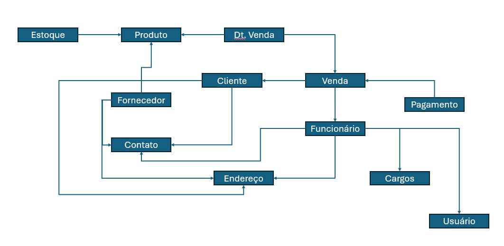

# Estudo de caso da casa Oliveira
## Desenvolvimento das modelagens do estudo de caso
### O estudo de caso:
#### Casa Oliveira
Roberto é dono de um mercado no bairro de Vargem Grande, na cidade de 
Tupã. Ele herdou o negócio de seu pai, Gumercindo Oliveira, ela foi aberta em 
1978 na garagem da casa da família, era uma pequena quitanda. Com o passar 
dos anos o negócio cresceu e Gumercindo foi obrigado a ir para outro ponto 
maior e ali permaneceu até os dias atuais.

Roberto, que agora é o novo dono do mercado continuou o negócio seguindo 
da mesma forma que o pai. Ele comprava diretamente com os fornecedores 
grandes volumes de produtos e armazenava em seu estoque. As vezes ele 
comprava muitos produtos que ainda havia em estoque causando uma 
sobrecarga de produtos, ele também tinha muitos produtos estragados, tais 
como: frutas, legumes, iogurtes, leites, frango etc. Também havia muitos 
produtos com o prazo de validade vencido.

Os funcionários eram poucos e faziam muitas coisas ao mesmo tempo. O 
açougueiro também ajudava no estoque, a moça da limpeza ajudava na 
organização dos produtos das prateleiras, além de ajudar na padaria, quanto o 
caixa estava vazio o operador ajudava a repor os laticínios e a limpar a loja. O 
repositor também fazia operação no caixa.

Ao realizar a venda o Roberto, que sabia o nome de quase todos os clientes, 
anotava em um caderno todos os produtos que vendia e que havia em estoque. 
Ao fim do dia , Roberto pegava o caderno de fazia os cálculos de o quanto 
havia vendido, somando o faturamento e realizando a atualização do estoque. 
Isso é feito todos os dias e toma um tempo considerável para que tudo seja 
feito.

Roberto fechava a loja as 18h, mas só ia para casa as 22h, após fazer todas as 
operações necessárias. Mesmo assim o negócio vai bem e Roberto pretende ir 
para outro ponto e aumentar o volume de negócios e contratar novos 
funcionários.

Marica, esposa de Roberto, vem conversando com ele há muito tempo para que 
ele contrate uma empresa para construir um sistema de informática para 
gerenciar o negócio e reduzir o tempo que ele passa trabalhando e tenha maior 
organização dos produtos, maior lucratividade e melhorar a gestão.
Com a intenção de aumentar o negócio, Roberto está disposto a informatizar 
sua empresa. Vamos ajudá-lo. Iremos começar construindo o banco de dados

#### Entidades levantadas: 
- Estoque;
- Produto;
- Venda;
- Detalhes da Venda;
- Cliente;
- Funcionário;
- Cargos;
- Usuário;
- Pagamento;
- Fornecedor;
- Endereço;
- Contato;

#### Primeiro diagrama:

